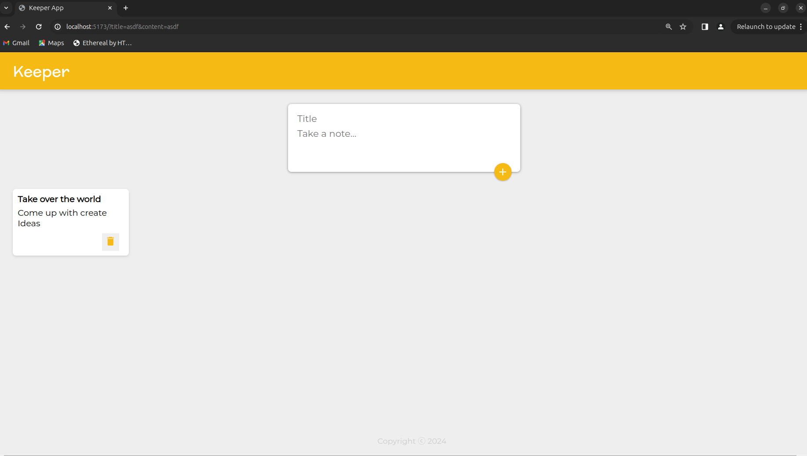

 I learned the basics of React, including how to create components, use hooks, props, State and utilize other features. I took a course called Web Development, taught by Dr. Angela Yu. For the final project, I created an application that resembles Google Keep. This learning experience will be invaluable in the future to help prevent code redundancy and improve my development skills.
